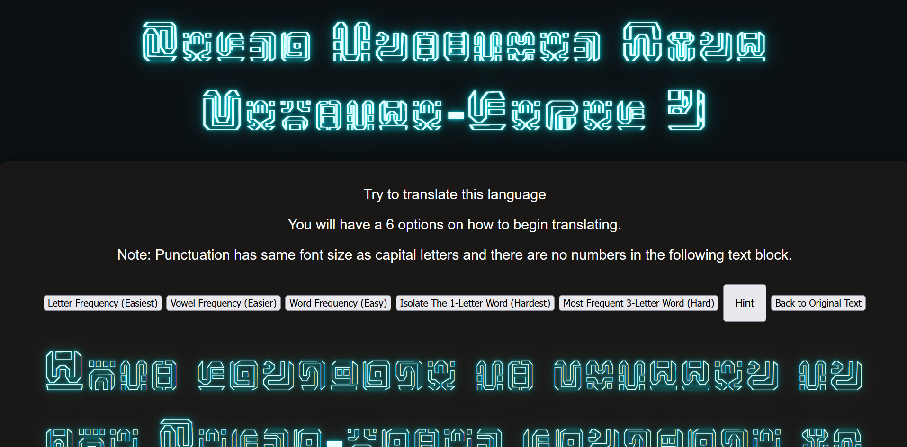
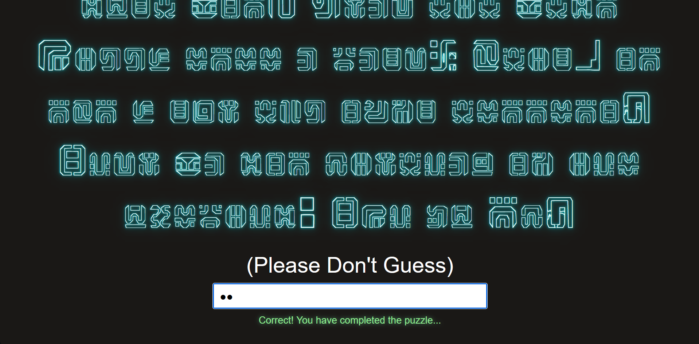
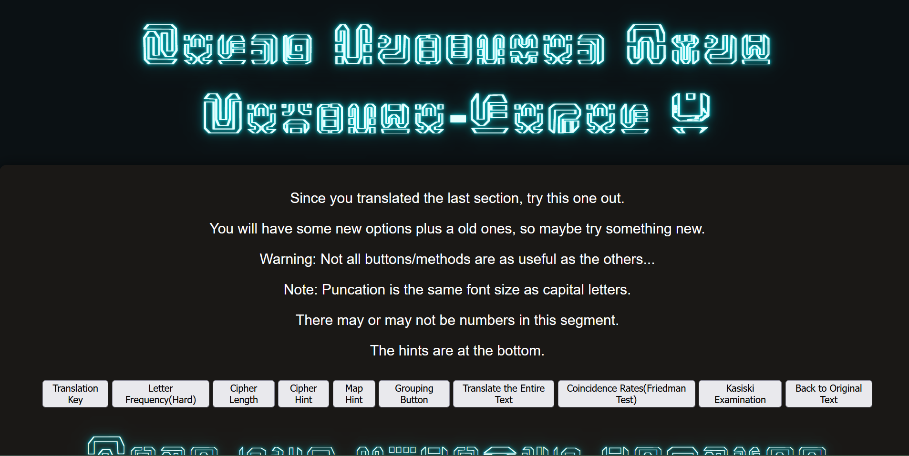

# Zelda-My-Font-Website
A website based on the Sheikah language from Legend of Zelda: Breath of the Wild. I combined this font with some cryptography, linguistics, and math, including Caesar ciphers, the Vigenère cipher, and the Seven Bridges of Königsberg. There are three interconnected websites(Challenge 1, Challenge 2, and HTML) that use a mix of my font/language and a normal font. I have also added various hint buttons that help people translate and decode the passages, allowing them to find the password needed to move to the next page. I hope to teach people some basic linguistic and cryptographic properties. 


## Live Interface Preview






## Demo URL

Website Link: [Zelda Based Font Web App](zelda-my-font-website.vercel.app)


## Built With

- HTML5 - structure
- CSS3 - styling and layout
- JavaScript - button and backend logic


## Author
Main Author: Dragoman23

GitHub: [@Dragoman23](https://github.com/Dragoman23)


## Run locally

Clone the repository:

```bash
git clone https://github.com/Dragoman23/Zelda-My-Font-Website.git
cd Zelda-My-Font-Website
python3 -m https.server 8000
```
Then open `http://localhost:8000` in your browser

Opening the `index.html` file directly will cause issues with local fonts, images, and JS.

-No Python?
```bash
npx serve .
```
or
```bash
npx http-server .
...

## Project structure

```text
Zelda-My-Font-Website/
│
├── css/               # Styling
├── fonts/             # Custom Sheikah-inspired font 
├── images/            # Screenshots and images
├── js/                # Button functionality, cipher/decoding scripts
├── Königsberg.png     # Seven Bridges of Königsberg image
├── index.html         # Challenge 1 (entry point)
├── challenge2.html    # Challenge 2
├── congrats.html      # Final page after solving both challenges
├── LICENSE
└── README.md
```

## AI Usage/Outside Sources

Some AI was used to help with minimal amounts of debugging and to get me my frequencies and clear explanations of hints

Seven Bridges of Königsberg image - https://share.google/f0emcEj0Utk65JWwu

## License

This project is open source and available under the [MIT License](LICENSE).


